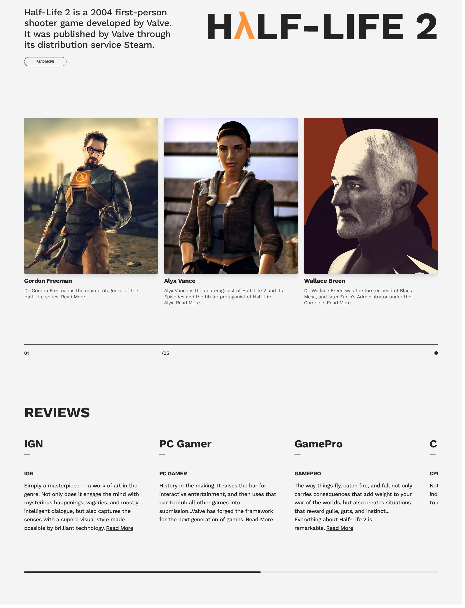

# Half Life 2 Home || Frontend Practice

This is a solution for one of the projects in [Frontend Practice](https://www.frontendpractice.com/) by recreating a **real website** from **real company**.

## Table of contents

- Overview
  - Features
  - Screenshot
  - Links
  - Setup
- My process
  - Built with
- Author

## Overview

### Features

Users should be able to:

- View the optimal layout for the site depending on their device's screen size
- Using `picture` tag to include the picture in multiple formats depending on the browser to optimize and minimize pictures size.
- Sliders work with mouse or touch screen in the review section.
- Hero section have a preview video about the game with a customized button that play a trailer on click.
- Animation appears depending on the viewport.

### Screenshot



### Links

- Live Site URL: [Here](https://half-life-2-home.vercel.app/)
- GitHub URL: [Here](https://github.com/MohanadOO/half-life-2-home)

### Setup

Using yarn 👇

```
$ yarn
$ yarn dev
```

Using NPM👇

```
$ npm install
$ npm run dev
```

## My process

### Built with

- [React](https://reactjs.org/) - JS library
- [Tailwind CSS](https://tailwindcss.com/) - CSS framework
- [Framer Motion](https://www.framer.com/motion/) - Animation Library for React
- [React Icons](https://react-icons.github.io/react-icons/) - React icons provides a huge collections of icons from different sources.

## Author

- Website - [Mohanad Portfolio](https://portfolio-mohanadoo.vercel.app/)
- Twitter - [@MohanadOO_](https://twitter.com/MohanadOO_)